# 🎬 Cinema Booking System
### *A Modern Full-Stack Movie Booking Platform*

[](https://reactjs.org/)
[](https://spring.io/projects/spring-boot)
[](https://www.mysql.com/)
[](https://tailwindcss.com/)  

> **🎯   InterviewBit SDE Intern Assignment** - A full-stack web application similar to BookMyShow with real-time seat booking, admin panel, and comprehensive booking management.

---

## 🎥 Live Demo

<div align="center">

[](https://drive.google.com/file/d/1JALK1n8bAfS_11lutUEUfXPVhUTcBS-b/view?usp=sharing)

*Complete user flow demonstration from cinema selection to booking confirmation*

</div>

---

## ✨ Implemented Features

### 🎭 Core Functionality
- **🎪 Cinema Browsing** - Browse multiple cinema locations with details
- **🎬 Movie Selection** - View movies with showtimes, ratings, and descriptions
- **🪑 Real-time Seat Selection** - Interactive seat map with live availability
- **🎫 Booking System** - Complete booking flow with confirmation
- **📱 Booking History** - View and manage past bookings
- **👤 User Authentication** - Login system with admin privileges
- **📱 Responsive Design** - Modern UI that works on all devices

### ⚡ Advanced Features
- **🔄 Real-time Concurrency** - Live seat blocking to prevent double bookings
- **🌐 WebSocket Integration** - Real-time updates across multiple users
- **🗄️ Database Relationships** - Proper foreign key constraints and cascade deletes
- **🛡️ Input Validation** - Validation on both frontend and backend
- **🎨 Modern UI/UX** - Beautiful interface with Tailwind CSS

---

## 🏗️ Architecture Overview


---

## 🗄️ Database Schema

### Entity Relationship Diagram


### Cascade Delete Implementation
- **Cinema deletion** → Cascades to Screens → Cascades to Seats and Shows
- **Movie deletion** → Cascades to Shows → Cascades to Bookings
- **User deletion** → Cascades to Bookings
- **Booking deletion** → Cascades to Seat status updates
- **Show deletion** → Cascades to Bookings

### Unique Constraints
- `(screen_id, date, time)` - Prevents double booking of same screen
- `email` - Ensures unique user accounts
- `seat_code` - Unique seat identification per screen

---

## 🚀 Tech Stack

### Frontend Technologies
<table>
<tr>
<td><strong>React 18</strong></td>
<td>Modern UI library with hooks and context API</td>
</tr>
<tr>
<td><strong>Vite</strong></td>
<td>Fast build tool and development server</td>
</tr>
<tr>
<td><strong>Tailwind CSS</strong></td>
<td>Utility-first CSS framework for styling</td>
</tr>
<tr>
<td><strong>React Router</strong></td>
<td>Client-side routing and navigation</td>
</tr>
<tr>
<td><strong>WebSocket</strong></td>
<td>Real-time bidirectional communication</td>
</tr>
</table>

### Backend Technologies
<table>
<tr>
<td><strong>Spring Boot 3.2.0</strong></td>
<td>Enterprise-grade Java framework</td>
</tr>
<tr>
<td><strong>Spring Data JPA</strong></td>
<td>Data persistence with Hibernate ORM</td>
</tr>
<tr>
<td><strong>MySQL 8.0</strong></td>
<td>Relational database management system</td>
</tr>
<tr>
<td><strong>WebSocket + STOMP</strong></td>
<td>Real-time messaging protocol</td>
</tr>
<tr>
<td><strong>Maven</strong></td>
<td>Dependency management and build automation</td>
</tr>
<tr>
<td><strong>Lombok</strong></td>
<td>Reduces boilerplate code with annotations</td>
</tr>
</table>

---

## 🎯 User Flow

### Customer Journey

```mermaid
flowchart TD
    A[🏠 Home Page] --> B[🎪 Select Cinema]
    B --> C[🎬 Choose Movie]
    C --> D[⏰ Pick Showtime]
    D --> E[🪑 Select Seats]
    E --> F[💰 Review Booking]
    F --> G[✅ Confirm Booking]
    G --> H[🎫 Booking Confirmation]
    H --> I[📱 View Booking History]
    
    style A fill:#E3F2FD
    style H fill:#C8E6C9
    style I fill:#FFF3E0
```


### Admin Workflow

```mermaid
flowchart TD
    A[🔐 Admin Login] --> B[📊 Dashboard]
    B --> C{Choose Action}
    C -->|Cinemas| D[🏢 Manage Cinemas]
    C -->|Movies| E[🎬 Manage Movies]
    C -->|Shows| F[⏰ Manage Shows]
    C -->|Bookings| G[🎫 View Bookings]
    
    D --> H[➕ Add/Edit/Delete]
    E --> H
    F --> H
    G --> I[📈 View Analytics]
    
    style A fill:#FFCDD2
    style B fill:#F8BBD9
    style H fill:#C8E6C9
```


---

## 🛠️ Installation & Setup

### Prerequisites
- **Node.js 18+** and npm
- **Java 17+**
- **Maven 3.6+**
- **MySQL 8.0+**

### Quick Start

#### 1. Clone Repository
```bash
git clone https://github.com/JatinSharma496/InterviewBit-Movie-Booking-System-.git
cd InterviewBit-Movie-Booking-System-
```

#### 2. Database Setup
```bash
# Create MySQL database
mysql -u root -p
CREATE DATABASE cinema_booking;
```

#### 3. Backend Setup
```bash
cd backend

# Update database credentials in src/main/resources/application.yml
# Default: username: root, password: password

# Run the backend
mvn spring-boot:run
```
**Backend runs on:** `http://localhost:8080`

#### 4. Frontend Setup
```bash
cd frontendd

# Install dependencies
npm install

# Start development server
npm run dev
```
**Frontend runs on:** `http://localhost:5173`

### Sample Data
The application automatically creates sample data on first startup:

| Entity | Count | Details |
|--------|-------|---------|
| **Users** | 2 | Admin + Regular user |
| **Cinemas** | 3 | PVR, INOX, Cinepolis locations |
| **Screens** | 6 | Multiple screens per cinema |
| **Movies** | 4 | War 2, Param Sundari, Fantastic Four, Thunderbolts |
| **Shows** | 16 | Multiple showtimes across screens |
| **Seats** | 600+ | Complete seat layouts for all screens |

---

## 🔧 API Endpoints

### Cinema Management
```http
GET    /api/cinemas                    # List all cinemas
GET    /api/cinemas/{id}              # Get cinema by ID
POST   /api/cinemas                   # Create new cinema (Admin)
PUT    /api/cinemas/{id}              # Update cinema (Admin)
DELETE /api/cinemas/{id}              # Delete cinema (Admin)
```

### Movie Management
```http
GET    /api/movies                    # List all movies
GET    /api/movies/{id}               # Get movie by ID
POST   /api/movies                    # Create new movie (Admin)
PUT    /api/movies/{id}               # Update movie (Admin)
DELETE /api/movies/{id}               # Delete movie (Admin)
```

### Show Management
```http
GET    /api/shows                     # List all shows
GET    /api/shows/{id}                # Get show by ID
GET    /api/shows/movie/{movieId}     # Get shows by movie
POST   /api/shows                     # Create new show (Admin)
PUT    /api/shows/{id}                # Update show (Admin)
DELETE /api/shows/{id}                # Delete show (Admin)
```

### Booking Management
```http
GET    /api/bookings                  # List all bookings (Admin)
GET    /api/bookings/{id}             # Get booking by ID
GET    /api/bookings/user/{userId}    # Get user bookings
POST   /api/bookings                  # Create new booking
PUT    /api/bookings/{id}/cancel      # Cancel booking
```

### Seat Management
```http
GET    /api/seats/screen/{screenId}   # Get seats by screen
POST   /api/seats/block               # Block seats temporarily
POST   /api/seats/unblock             # Unblock seats
```

### WebSocket Endpoints
```http
ws://localhost:8080/ws                # WebSocket connection
/topic/seats                          # Subscribe to seat updates
/app/seats/block                      # Block seats via WebSocket
/app/seats/unblock                    # Unblock seats via WebSocket
```

---

## 🎨 UI/UX Features

### Seat Selection Interface
| Status | Color | Description |
|--------|-------|-------------|
| **Available** | 🔘 Gray | Ready for selection |
| **Selected** | 🟢 Green | Chosen by current user |
| **Blocked** | 🟡 Yellow | Temporarily blocked by another user |
| **Booked** | 🔴 Red | Already confirmed and paid |

### Interactive Features
- **Real-time Updates**: Live seat availability changes
- **Maximum Selection**: 6 seats per booking limit
- **Visual Feedback**: Loading states and success messages
- **Error Handling**: User-friendly error popups

---

## 🔒 Security & Validation

### Backend Security
- **Input Validation**: Jakarta Validation annotations
- **CORS Configuration**: Secure cross-origin requests
- **SQL Injection Prevention**: JPA parameterized queries
- **Error Handling**: Proper HTTP status codes

### Data Integrity
- **Foreign Key Constraints**: Referential integrity
- **Transaction Management**: ACID compliance
- **Seat Concurrency Control**: Prevents double booking
- **Automatic Cleanup**: Expired seat blocks removal

---

## 📊 Real-time Features

### WebSocket Implementation
- **Seat Blocking**: 5-minute timeout with automatic cleanup
- **Live Updates**: Real-time seat availability across users
- **Concurrency Control**: Prevents double booking
- **Efficient Communication**: STOMP protocol for messaging

### Frontend Optimization
- **Component Architecture**: Reusable and maintainable code
- **Context API**: Efficient state management
- **Responsive Design**: Works on all device sizes
- **Smooth Animations**: CSS transitions and hover effects

---

## 🧪 Testing

### Manual Testing
- [ ] User registration and login
- [ ] Cinema browsing and selection
- [ ] Movie and showtime selection
- [ ] Real-time seat selection
- [ ] Booking confirmation
- [ ] Booking history and cancellation
- [ ] Admin panel functionality

---

## 📁 Project Structure

```
cinema-booking-system/
├── frontendd/                 # React Frontend
│   ├── src/
│   │   ├── components/       # React components
│   │   ├── context/          # State management
│   │   └── ...
│   ├── package.json
│   └── vite.config.js
├── backend/                   # Spring Boot Backend
│   ├── src/main/java/com/cinema/
│   │   ├── controller/       # REST controllers
│   │   ├── service/          # Business logic
│   │   ├── entity/           # JPA entities
│   │   ├── repository/       # Data repositories
│   │   ├── dto/              # Data Transfer Objects
│   │   └── config/           # Configuration
│   ├── pom.xml
│   └── README.md
└── README.md                  # This file
```
